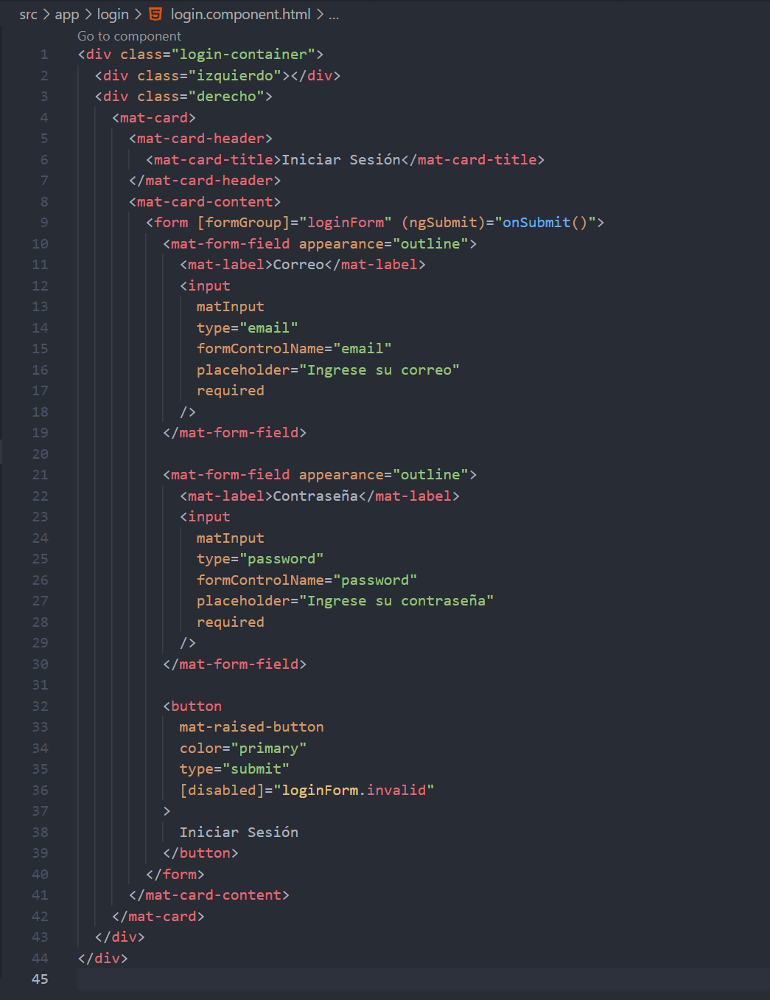

# Consumo de APIs en Angular

Se utiliza la API pública: https://api.escuelajs.co/api/v1/users

## Servicio para consumir el API

    
    
Codigo para conosumir el api

- HttpClient: Es un servicio que permite realizar solicitudes HTTP (GET, POST, PUT, DELETE, etc.) desde tu aplicación Angular.

- Injectable: Marca esta clase como un servicio que puede ser inyectado en otros componentes o servicios de Angular mediante el sistema de Inyección de Dependencias. Al declararlo con providedIn: 'root', Angular se encarga de instanciar este servicio como un singleton (única instancia para toda la app).

- Observable: Forma parte de rxjs (Reactive Extensions for JavaScript) y es el patrón que Angular usa para manejar flujos de datos asincrónicos, como las respuestas HTTP.

- urlBase: Define la URL base de la API que se consumirá. Es una buena práctica usar variables para las URLs en lugar de hardcodearlas en cada método.

1. Firma del método:
    - Devuelve un Observable<Usuario[]>, lo que significa que este método no retorna los datos inmediatamente, sino que proporciona un stream que emite los datos cuando están disponibles.
    - El tipo Usuario[] indica que se espera una respuesta en forma de un array de objetos del tipo Usuario.

2. Llamada HTTP:
    - this.clienteHttp.get<Usuario[]>(this.urlBase):
    Usa el método get del servicio HttpClient para realizar una solicitud HTTP GET a la API.
    - El tipo genérico <Usuario[]> le indica a TypeScript qué tipo de datos espera de la respuesta (un array de usuarios).
    - this.urlBase: La URL a la que se envía la solicitud.

3. Retorno:
    - return: Devuelve el observable generado por HttpClient. Este observable puede ser suscrito por cualquier componente o servicio que necesite usar los datos.

## Agregar HttpClientModule

    
    
Agregacion de HttpClientModule para realizar peticiones HTTP

1. Explicación del provideHttpClient
    - provideHttpClient(withFetch()): Configura HttpClient para usar la API Fetch. Esto puede ser útil para aprovechar las capacidades modernas de Fetch API, como mejores promesas y soporte para streams.
    - provideHttpClient(): Simplemente proporciona HttpClient sin ninguna configuración adicional.
    - Ambos se aseguran de que HttpClient esté disponible en toda tu aplicación, permitiéndote hacer solicitudes HTTP desde tus servicios.

## Consumir el servicio en un Componente

    
    
Metodo para consumir el servicio

- En el código se muestra cómo un componente en Angular utiliza el servicio para consumir una API y manejar los datos obtenidos.

1. ngOnInit
    - ngOnInit(): Método del ciclo de vida del componente que se ejecuta automáticamente después de que Angular ha inicializado el componente.
    - Dentro de ngOnInit, se llama al método obtenerUsuarios para cargar los datos cuando el componente se inicializa.

2. subscribe
    - subscribe: Escucha las respuestas del observable.
        - next: Se ejecuta si la solicitud es exitosa.
            - Asigna los datos obtenidos (datos) a las propiedades:
                - this.usuarios: Almacena los usuarios obtenidos.
                - this.dataSource.data: Si se está utilizando una tabla (como Angular Material), actualiza los datos para mostrar en el frontend.
        - error: Maneja errores si la solicitud falla.

## Preguntas

¿Qué hace el método getUsers en este servicio?
Consume el api y regresa una Observable que contiene un arreglo de datos

¿Por qué es necesario importar HttpClientModule?
HttpClientModule es necesario en Angular para habilitar el uso de HttpClient, que permite realizar peticiones HTTP a APIs y servidores externos en la aplicación.

¿Qué función cumple el método ngOnInit en el componente UserListComponent?
El método ngOnInit se utiliza para inicializar el componente y es el lugar ideal para cargar datos o llamar servicios cuando el componente se muestra por primera vez en la vista.

¿Para qué sirve el bucle *ngFor en Angular?
El bucle *ngFor en Angular permite iterar sobre una lista de elementos y renderizarlos en la plantilla del componente, mostrando cada elemento de forma dinámica en la vista.

¿Qué ventajas tiene el uso de servicios en Angular para el consumo de APIs?
Los servicios centralizan la lógica de consumo de datos, permitiendo que los componentes se enfoquen en la presentación. Facilitan la reutilización del código, la inyección de dependencias y las pruebas, mejorando la estructura y mantenimiento de la aplicación.

¿Por qué es importante separar la lógica de negocio de la lógica de presentación?
Separar estas lógicas permite que los componentes sean más manejables y modulares, facilitando cambios en la interfaz sin afectar la lógica de negocio y manteniendo el código más claro y escalable.

¿Qué otros tipos de datos o APIs podrías integrar en un proyecto como este?
Podrías añadir APIs de autenticación, geolocalización, pagos, redes sociales o análisis. Estas integraciones aportan funciones adicionales que enriquecen la experiencia del usuario y amplían las capacidades del proyecto.

# Ejercicio Login - Consumir APIS de terceros

Para este ejercicio se continuara consumiendo la API anteriormente mencionada: https://api.escuelajs.co/api/v1/users

    
    
Servicio para consumir el API

    
    
Agregacion de HttpClientModule para realizar peticiones HTTP

    
    
Metodo para consumir el servicio

## Componente Login

### Html necesario en el formulario de Login

    
    
Metodo para consumir el servicio

Este código es una estructura de HTML con Angular Material para crear un formulario de inicio de sesión con diseño dividido en dos secciones: una izquierda y otra derecha.

1. Contenedor principal:
    - div class="login-container": Es el contenedor principal que incluye dos secciones:
        - izquierdo: para una imagen.
        - derecho: Contiene el formulario de inicio de sesión.
2. Tarjeta del formulario:
    - Usa un mat-card para organizar visualmente el formulario.
    - mat-card-header: Incluye un título "Iniciar Sesión".
3. Formulario:
    - form: Está vinculado al formulario reactivo loginForm de Angular a través de [formGroup].
    - (ngSubmit)="onSubmit()": Llama al método onSubmit() cuando se envía el formulario.
3. Campos de entrada:
    - Correo:
        - Usa un campo de entrada con Angular Material (mat-form-field).
        - Vinculado al control email del formulario reactivo (formControlName="email").
    - Contraseña:
        - Campo de entrada similar, vinculado al control password.
5. Botón de envío:
    - Botón de tipo submit con estilo de Angular Material (mat-raised-button).
    - Deshabilitado si el formulario es inválido ([disabled]="loginForm.invalid").

### Codigo para validar las credenciales ingresadas

    
    
Metodo para consumir el servicio

Este código define la lógica para manejar el inicio de sesión en una aplicación.

1. Validación del formulario:
    - Comprueba si el formulario de inicio de sesión (loginForm) es válido usando this.loginForm.valid.
    - Si es válido, extrae los valores de email y password del formulario.
2. Verificación de credenciales:
    - Itera sobre la lista de usuarios (this.usuarios) para comprobar si existe un usuario con un correo (email) y contraseña (password) que coincidan.
    - Si encuentra una coincidencia:
        - Establece entrada = true y detiene la búsqueda.
3. Manejo de resultados:
    - Si las credenciales son correctas (entrada === true):
        - Muestra un mensaje de éxito con SweetAlert2.
        - Redirige al usuario al dashboard usando this.router.navigate(['dashboard']) después de confirmar el mensaje.
    - Si las credenciales son incorrectas:
        - Muestra un mensaje de error con SweetAlert2 indicando que los datos son incorrectos.

## Resultado Final de la Vista Login 

    
    
Interfaz de Inicio de Sesion

## Notificaciones 

Se utilizo SweetAlert2: https://sweetalert2.github.io/#download

### Notificacion de error al ingresar

    
    
Mensaje de Error

### Notificacion de exito al ingresar

    
    
Mensaje de Exito

## Ventana mostrada despues de iniciar sesion 

    
    
Ventana de Inicio

En esta ventana se listan los usuarios que se encuentran en la API. 

